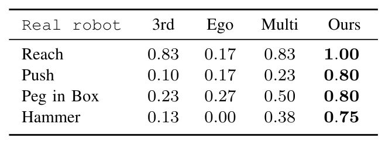
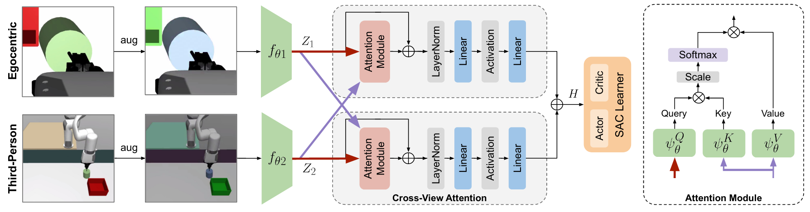
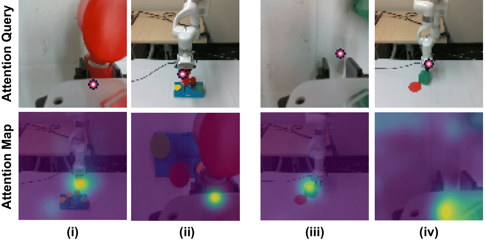

# Look Closer: Bridging Egocentric and Third-Person Views with Transformers for Robotic Manipulation

Official PyTorch implementation for the paper

**Look Closer: Bridging Egocentric and Third-Person Views with Transformers for Robotic Manipulation**
[Rishabh Jangir*](https://jangirrishabh.github.io/), [Nicklas Hansen*](https://nicklashansen.github.io/), [Sambaran Ghosal](https://github.com/SambaranRepo), [Mohit Jain](https://natsu6767.github.io/), and [Xiaolong Wang](https://xiaolonw.github.io/)

[[arXiv]](#), [[Webpage]](https://jangirrishabh.github.io/lookcloser/)

## Installation

GPU access with CUDA >=11.1 support is required. Install MuJoCo if you do not have it installed already:

* Obtain a license on the MuJoCo website.
* Download MuJoCo binaries here.
* Unzip the downloaded archive into `~/.mujoco/mujoco200` and place your license key file `mjkey.txt` at `~/.mujoco`.
* Use the env variables `MUJOCO_PY_MJKEY_PATH` and `MUJOCO_PY_MUJOCO_PATH` to specify the MuJoCo license key path and the MuJoCo directory path.
* Append the MuJoCo subdirectory bin path into the env variable `LD_LIBRARY_PATH`.

Then, the remainder of the dependencies can be installed with the following commands:

```
conda env create -f setup/conda.yml
conda activate lookcloser
```

## Training

We provide training scripts for solving each of the four tasks using our method. The training scripts can be found in the `scripts` directory. Training takes approximately 16 hours on a single GPU for 500k timesteps.

Command: ``` bash scripts/multiview.sh ``` runs with the default arguments set towards training the reach environment with image observations with our crossview method.

Please take a look at ```src/arguments.py``` for detailed description of arguments and their usage. The different baselines considered in the paper can be run with little modification of the input arguments.

## Results

We find that while using multiple views alone improves the sim-to-real performance of SAC, our Transformer-based view fusion is far more robust across all tasks.



See [our paper](#) for more results.

## Method

Our method improves vision-based robotic manipulation by fusing information from multiple cameras using transformers. The learned RL policy transfers from simulation to a real robot, and solves precision-based manipulation tasks directly from uncalibrated cameras, without access to state information, and with a high degree of variability in task configurations.



### Attention Maps
We visualize attention maps learned by our method, and find that it learns to relate concepts shared between the two views, e.g. when querying a point on an object shown the egocentric view, our method attends strongly to the same object in the third-person view, and vice-versa.


## Tasks

Together with our method, we also release a set of four image-based robotic manipulation tasks used in our research. Each task is goal-conditioned with the goal specified directly in the image observations, the agent has no access to state information, and task configurations are randomly initialized at the start of each episode. The provided tasks are:

* **Reach:** Reach a randomly positioned mark on the table with the robot's end-effector.
* **Push:** Push a box to a goal position indicated by a mark on the table.
* **Pegbox:** Place a peg attached to the robot's end-effector with a string into a box.
* **Hammerall:** Hammer in an out-of-position peg; each episode, only one of four pegs are randomly initialized out-of-position.


## Citation

If you find our work useful in your research, please consider citing the paper as follows:

```
@ARTICLE{jangir2022look,
  author={Jangir, Rishabh and Hansen, Nicklas and Ghosal, Sambaran and Jain, Mohit and Wang, Xiaolong},
  journal={IEEE Robotics and Automation Letters}, 
  title={Look Closer: Bridging Egocentric and Third-Person Views with Transformers for Robotic Manipulation}, 
  year={2022},
  volume={},
  number={},
  pages={1-1},
  doi={10.1109/LRA.2022.3144512}}
```
## License

This repository is licensed under the MIT license; see `LICENSE` for more information.
